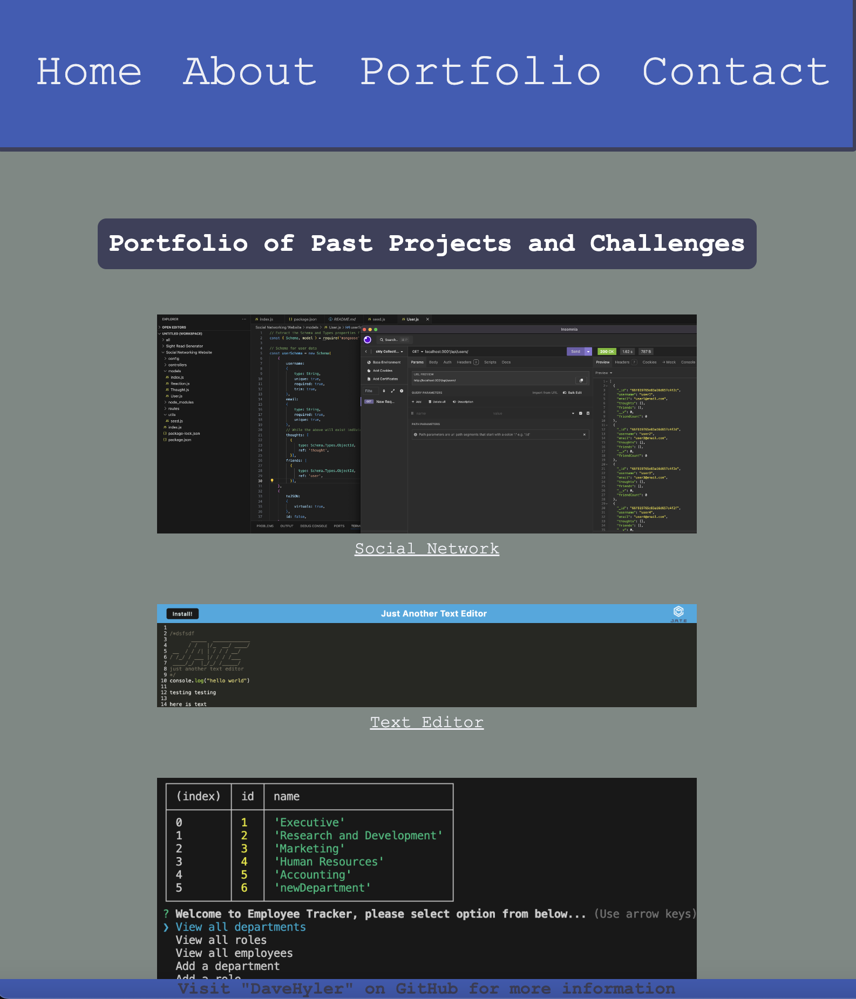

# React-Portfolio
Module 20 React Challenge

<h3>By User davehyler</h3>
<!-- Optional Screenshot will show if user places one within the same directory as this readme. -->

 
<i>Will no longer be submitting videos for grading. Deduct if necessary as the points don't seem to show up even when there is a video present.</i>
<nav>
<h2>Table Of Contents</h2>
<ol>
<li><a href="#title">Title</a></li>
<li><a href="#username">Username</a></li>
<li><a href="#email">Email</a></li>
<li><a href="#stack">Stack</a></li>
<li><a href="#license">License</a></li>
<li><a href="#description">Description</a></li>
<li><a href="#instructions">Installation Instructions</a></li>
<li><a href="#usage">Usage</a></li>
<li><a href="#guidelines">Guidelines</a></li>
<li><a href="#testing">Testing</a></li>
</ol>
</nav>
<ul class="list-group">
<h2>Project Information</h2>
<h3 id="stack">Stack used:</h3>

<h3 id="license">License: MIT</h3>

Badge: 

<h3 id="description">Description of project:</h3>

A simple portfolio style website with dynamic elements generated in realtime by the React Framework.

<h3 id="instructions">Installation Instructions:</h3>

Make sure to install any dependancies (see package.json in same directory) prior to attempting to run, then within your terminal running within the directory of "server.js", type the command "node server.js" to begin and follow the prompts.

<h3 id="usage">How to use:</h3>

Visit https://gregarious-licorice-c58194.netlify.app/ for dynamic deployment

<h3 id="guidelines">Guidelines for Contribution:</h3>

Make sure all submissions are compatible with the current codebase.

<h3 id="testing">Tests</h3>

Make sure to install "jest" prior to writing any testing for this application.

</ul>
<h3>Questions? Contact Me:</h3>
<ul class="list-group">
<li class="list-group-item">GitHub username: davehyler</li>
<li class="list-group-item">Email:  davehyler@github.com (placeholder, do not use. Will not post personal information on assignments present on publicly scrapable websites)</li>
</ul>
